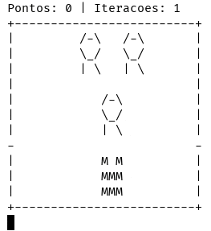

# ASCII-Space-Invaders

<p align="center">
  
</p>


Este é um projeto desenvolvido como parte de uma disciplina que fui monitor durante meu mestrado na UFES (Universidade Federal do Espírito Santo). O código implementa um jogo inspirado no clássico Space Invaders, onde o jogador controla uma nave espacial para eliminar inimigos que descem em direção à sua posição.

Para informações mais detalhadas sobre o projeto, recomenda-se a leitura do PDF do trabalho disponível na raiz do repositório (**trabalho.pdf**). O documento contém todas as especificações requeridas e uma explicação mais detalhada sobre o funcionamento do jogo.

## Estrutura do Projeto
O projeto está organizado da seguinte forma:

```
space/
|__ inputs/
    |__ 1/
    |   |__ entrada.txt
    |   |__ inimigo.txt
    |   |__ mapa.txt
    |   |__ saida/
    |
    |__ 2/
        |__ entrada.txt
        |__ inimigo.txt
        |__ mapa.txt
        |__ saida/
        
|__ README.md
|__ space.c
|__ trabalho.pdf
```
Na pasta inputs, estão armazenadas as configurações dos níveis do jogo. Cada subpasta numerada representa um nível diferente do jogo, contendo os arquivos de entrada necessários para sua execução. Cada pasta de nível contém os seguintes arquivos:

- **entrada.txt:** Teclas utilizadas durante uma partida (útil para fazer o redirecionamento da entrada padrão).
- **inimigo.txt:** Arquivo descrevendo a aparência dos inimigos.
- **mapa.txt:** Descrição do mapa do nível.
- **saida/:** Pasta onde são armazenados os arquivos de saída gerados durante a execução do jogo.

## Compilação e Execução
Para compilar e executar o código, utilize os seguintes comandos:

```bash
gcc -o space space.c
./space inputs/1
```

O jogo também pode ser executado com a flag **ANIMATED_INPUT**, que ativa a animação na entrada de comandos (modo feito para ser utilizado com o redirecionamento da entrada padrão), ou a flag **EXTRA_POINT**, que ativa a troca de tile dos inimigos.

```bash
gcc -o space space.c -DANIMATED_INPUT -DEXTRA_POINT
./space inputs/1 < inputs/1/entrada.txt
```

Existem também flags que adicionam funcionalidades extras pedidas no dia da correção, totalizando 3 opções. Para compilar o código com essas alterações, você pode utilizar as flags **CHECK_1**, **CHECK_2** ou **CHECK_3**, precedidas pela flag -D do gcc.

```bash
gcc -o space space.c -DCHECK_1 -DCHECK_2 -DCHECK_3
./space inputs/1 < inputs/1/entrada.txt
```

## Como criar novas entradas

A flag **SAVE_INPUT** permite salvar todas as teclas pressionadas pelo jogador durante a execução do jogo em um arquivo de texto chamado entrada.txt.

Essa funcionalidade é útil para criar novas entradas utilizando o redirecionamento da entrada padrão. Quando a flag **SAVE_INPUT** está ativada, as teclas pressionadas durante uma partida são registradas em um arquivo (**entrada.txt**) dentro do diretório informado.


```bash
gcc -o space space.c -DSAVE_INPUT
./space inputs/1
```

## Jogabilidade
O jogador pode interagir com o jogo por meio de comandos simples, como movimentar-se para a esquerda (**A**) ou direita (**D**), atirar (**Espaço**) e avançar para o próximo estado do jogo sem fazer nenhuma ação (**S**).

No jogo, os inimigos se movem horizontalmente para a esquerda e para a direita dentro do mapa, mudando de direção quando atingem as bordas. Além disso, eles também descem verticalmente, ao colidirem com as laterais, aproximando-se do jogador.

O jogador ganha quando todos os inimigos são eliminados do mapa, ou perde quando um ou mais inimigos alcançam a borda inferior do mapa.

## Arquivos Gerados
Durante o jogo, são gerados arquivos para monitorar a partida e seu progresso. Sendo eles:

**Arquivo de Inicialização (inicializacao.txt):**
- Este arquivo contém uma representação visual do mapa inicial do jogo, juntamente com a posição inicial do jogador.

**Arquivo de Ranking (ranking.txt):**
- O arquivo de ranking registra as informações sobre os inimigos atingidos pelo jogador durante o jogo. Ele inclui detalhes como a fileira e a posição do inimigo atingido, juntamente com a iteração em que o evento ocorreu.

**Arquivo de Mapa de Calor (heatmap.txt):**
- Este arquivo contém informações sobre o mapa de calor do jogo, que mostra as áreas mais frequentemente visitadas pelo jogador e onde os tiros andaram.

**Arquivo de Estatísticas (estatisticas.txt):**
- O arquivo de estatísticas registra várias estatísticas relevantes do jogo, como o número total de movimentos do jogador, tiros efetivos, tiros perdidos e descidas de inimigos.

## Observações
Este projeto faz parte de uma disciplina introdutória à programação, como os alunos não foram introduzidos a conceitos mais avançados como ponteiros e passagem por referência, o código não utiliza esses recursos.

O foco desse trabalho é na prática de conceitos básicos de programação, como estruturas de controle, funções e manipulação de arquivos.

Este projeto é destinado principalmente para fins educacionais, permitindo que os alunos pratiquem os fundamentos da programação. 
